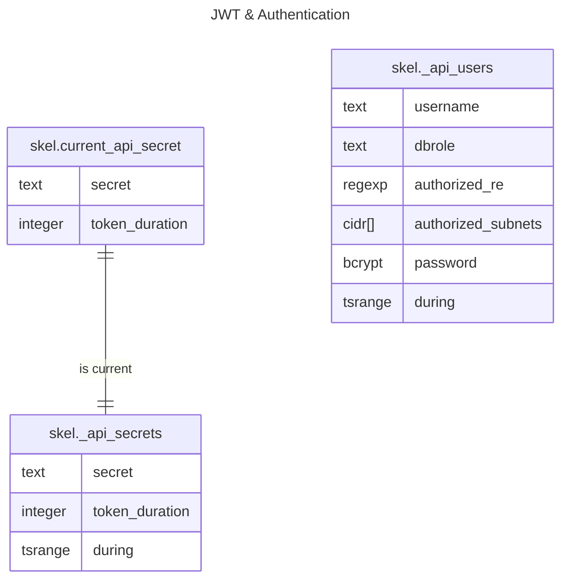

# Database schema generation scripts

The `.ddl` files in this directory contains the DDL that defines the required objects in the database. The general idea is to split your database schema creation in sensible sections that can be applied in sequence by the `Makefile` rules -- take a look at that file to see the specific order in which they are invoked. The basic actions provided by these rules are also available as standalone shell scripts. This helps with deployments employing AWS Lambda, where GNU Make is unable to launch external programs due to its use of blocked system calls.

Of course, you're free to adapt this to your own style. In some cases a single `.ddl` file with all commands will do. In more complex scenarios, you might want to have subdirectories containing the DDL for large parts of your database schema.

In general terms, these `.ddl` files are meant to deploy your database schema to a plain, blank database.

## Makefile provisioning and AWS Lambda

At the time of this writing, the AWS Lambda environment imposes a series of security restrictions on the workloads it executes. One such restriction involves the use of _tracing syscalls_. GNU Make uses some of these calls internally to track the status of its subprocesses, which causes issues when attempting deployments via λ. These examples are migrating towards a shell-script based deployment strategy to simplify deployments in these types of environments.

For any new applications you should plan on invoking the following scripts instead of the corresponding `Makefile` targets.

| Script         | Replaces `make` target | Purpose |
| :------------- | :--------------------- | :------- |
| `./deploy.sh`  | `deploy`               | Deploys a pristine database schema _without_ any additional schema deltas. |
| `./deltas.sh`  | `deltas`               | Applies all pending deltas. |
| `./destroy.sh` | `destroy`              | Destroys the schema and its data using your provided scripts. |
| `./test.sh`    | `test`                 | Run database test suite with `pg_prove`. |

## Namespace support

The provided scripts create multiple namespaces to help keep the different
components of a project logically separated. One namespace is meant to keep
the _private_ parts of your schema, while the others are meant to be used in
combination with [PostgREST](https://postgrest.org/) for managing a separate
REST API.

To set the desired namespace names you can use the environment variables
`$PGNAMESPACE`. `$PGAPINAMESPACE` and `$PGCFGNAMESPACE`. Note that these environment variables
are folded into `psql` variables `:nspace`, `:apinspace` and :`cfgnspace` that can be used
across the rest of the provisioning scripts.

The design assumes that there will be at least one namespace per application
sharing the database.

By default, the scripts attempt a conditional namespace creation, as depicted
below.

```sql
CREATE SCHEMA IF NOT EXISTS :"nspace";
CREATE SCHEMA IF NOT EXISTS :"apinspace";
CREATE SCHEMA IF NOT EXISTS :"cfgnspace";
```

Both the `Makefile` and supplied shell scripts default to `skel`, `apiskel`
and `cfgskel` as the namespaces.

Previous versions of this schema skeleton did not attempt to destroy the
namespaces when `make destroy` was invoked. This has been reversed for the
time being. You might want to revise the provided script if this behavior is
problematic for your own setup.

## Support for PostgREST

Roles, users and a few tables are provided to assist with deployments that
plan to use PostgREST for API provisioning. Base functions to control
configuration, store JWT secrets and authenticate users are provided.

Also, a simple `ping` view suitable for providing a method to check the
database availability is present as well.

The file `etc/postgrest.conf` included in this repo provides for a simple setup
that should be suitable for your own development environment. Me sure you
revise this file, specially when you customize your configuration.

> For production deployments, you should consider using nginx as a reverse proxy
in front of your PostgREST instance, providing TLS and rate limiting services
as needed.

### Authentication and secrets

The database schema defines the following tables, used to manage JWT secrets
securely as well as for per-user authentication.



The table below provides a brief summary of the purpose of each column.

| Table | Column | Notes |
| :---- | :----- | :---- |
| `_api_secrets` | `secret`         | Randomly generated secret |
| `_api_secrets` | `token_duration` | Lifetime of generated tokens, in seconds |
| `_api_secrets` | `during`         | Time interval during which this secret will be valid |
| `_api_users`   | `username`       | Used for per-user authentication |
| `_api_users`   | `dbrole`         | Associated database role for the successfully authenticated user |
| `_api_users`   | `authorized_re`  | For authorization, this regular expression _must_ match the method and request path, see below |
| `_api_users`   | `authorized_subnets`  | For authorization, an optional list of CIDR subnets restricting the authorized request origins, see below |
| `_api_users`   | `password`       | The hashed password for the user |
| `_api_users`   | `during`         | Time interval during which this credential is valid |

JWT secrets can be easily rotated using:

```sql
SELECT skel.reset_api_secret();
```

Note that this function generates a new JWT secret _and_ destroys the prior
secret, following the principle of destrooying obsolete or deprecated key
material. Upon rotating the secret, all existing JWT tokens become
automatically invalid.

You migth consider using the pg_cron extension to trigger automatic, periodic
secret rotation.

The current JWT secret is available as follows:

```sql
SELECT * FROM skel.current_api_secret;
```

### Authorization

The authorization scheme managed by `_api_users.authorized_re` implements a
simplistic approach. For each request, the signature `<METHOD>:<PATH>` is
composed and matched against the regular expression on
`_api_users.authorized_re` for the corresponding user.

If the regular expression fails to match, the request is rejected through an
exception that gets marshaled to an error response by PostgREST. This
mechanism is a _complement_ to the role-based access controls that can be
implemented by Postgres.

By setting a suitable regular expression, a variety of access restrictions can
be deployed. A few examples include:

| Regular Expression    | Notes |
| :-------------------- | :---- |
| `^GET:`               | Read-only access |
| `[^\w]+:/auhtorized/` | Provide access to only a subset of the operations |

Using lookahead and lookbehind assertions, much richer access restrictrions
can be deployed.

An additional means of authorization lies in the source IP of a given request.
When `_api_users.authorized_subnets` is populated with an array if `CIDR`
subnets and the upstream proxy provides the `X-Real-IP` header as with the
[ngx_http_realip_module](https://nginx.org/en/docs/http/ngx_http_realip_module.html)
Nginx module, requests will only be accepted when comming from an IP address
from within one of the covered subnets.

The following Nginx directives work well when setting up the reverse proxy:

```
proxy_set_header        X-Forwarded-For         $proxy_add_x_forwarded_for;
proxy_set_header        X-Real-IP               $remote_addr;
proxy_set_header        Host                    $http_host;
proxy_set_header        Connection              "";
```

### Previewing and interacting with the API

Follow the [instructions from
redocly.com](https://redocly.com/docs/redoc/deployment/docker/) to launch
redoc in a Docker container and point it to your environment, which in my case
is at `localhost:3000`

```bash
docker run -p 8080:80 -e SPEC_URL=http://10.54.32.10:3000/ redocly/redoc
```

Pointing your browser to http://localhost:8080 will present a pretty rendering
of your API.

For simple testing, you can create a user in your local database:

```sql
INSERT INTO _api_users ( username, password ) VALUES ( 'lem', '1234567890' );
```

And then , you can easily check the authentication:

```bash
curl 'http://localhost:3000/rpc/login?username=lem;password=1234567890'
{"token":"eyJhbGciOi⋯Mz7w"}
```

The token can then be used to access other functions, in this case, the
`/ping` endpoint. Simply use the token in your `Authorization` header, as
shown below.

```bash
curl -X 'GET' \
  'http://0.0.0.0:3000/ping' \
  -H 'accept: application/json' \
  -H 'Range-Unit: items' \
  -H 'Authorization: Bearer eyJhbGciOi⋯Mz7w'
```

The response should be as follows:

```json
[
  {
    "alive": true,
    "message": "Database connection is established",
    "ts": "2023-12-23T13:53:22.206356",
    "username": "lem"
  }
]
```

## Configuring database coordinates

Scripts are executed via the `psql` tool, so any of the methods supported by that tool work for deployment. See the [psql Environment section](https://www.postgresql.org/docs/9.6/static/app-psql.html#APP-PSQL-ENVIRONMENT) for more information on the variables to use to point your deployment as desired. Specially the `PGDATABASE`, `PGHOST`, `PGPORT` and `PGUSER` variables.

An easy way to deploy a database could be as follows. In this example, `.pgpass` is used to supply the credentials automatically.

    PGHOST=my.db.host PGUSER=production_user make deploy

## Updating other database instances

Other database instances such as QA and Production will normally operate without the most recent _deltas_. As the time to deploy those _deltas_ come, it can be as simple as doing this.

    PGHOST=my.db.host PGUSER=production_user make deltas

## Destroying database schemas

The `destroy` target can be dangerous when working against a production instance. To help in preventing expensive errors, the shipped `destroy.ddl` includes a simple safeguard preventing harm to unknown databases.

> Make sure to edit your `destroy.ddl` file to match your environment. You should never be able to execute the `destroy` target against production!

The example below shows what happens when you try to `make destroy` the production database, by mistake.

    $ PGHOST=my.prod.database make destroy
    ( cd db; PSQLRC=psqlrc-test make destroy )
    psql -f destroy.ddl
    psql:destroy.ddl:23: ERROR:  cannot destroy this database
    HINT:  only database dev,qa,lem can be destroyed
       ⋮
    psql:destroy.ddl:25: ERROR:  current transaction is aborted, commands ignored until end of transaction block
    psql:destroy.ddl:25: STATEMENT:  DROP TABLE IF EXISTS schema_errata;
    rm -f schema_errata.csv

You will need to tweak the definition of `app.ephemeral_dbs` to include the databases that you wish to be able to `destroy`.
